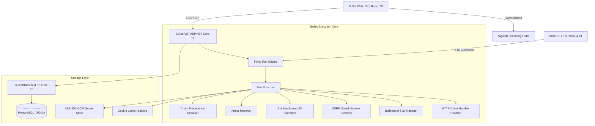

# BULLET — The Fast, Local-First Postman Alternative 🎯

[](https://bulletapp.github.io/bullet/)
[](https://github.com/bulletapp/bullet)
[](https://github.com/bulletapp/bullet/releases/latest)
[](LICENSE)

> **BULLET** is the blazing-fast, open-source, local-first alternative to Postman and Insomnia for testing **REST**, **GraphQL**, **gRPC**, and **WebSockets**. Built with **.NET 10**, **C# 13**, **React 19**, and **Vite** — engineered with zero cloud lock-in, absolute offline privacy, mTLS client certificates, and serverless WiFi Mesh LAN collaboration.
>
> 🌐 **Official Website & Live Weapon Simulator:** [https://bulletapp.github.io/bullet/](https://bulletapp.github.io/bullet/)

> [!IMPORTANT]
> 🚀 **Initial Public Release (`v0.0.2`)**  
> BULLET is fresh off the launchpad! While core HTTP/3, gRPC, scripting, and mesh engines are fully functional, you may encounter edge cases as we rapidly iterate. If you discover a bug or have an idea, please [open a GitHub Issue](https://github.com/bulletapp/bullet/issues)—your feedback directly drives the next release!

---

## ⚔️ Why BULLET vs. Postman?

Frustrated with Postman's forced cloud logins, collection run paywalls (25 runs/month limit), bloated Electron memory usage, and cloud privacy risks? **BULLET** was architected from the ground up as a high-velocity, local-first powerhouse:

| Capability | BULLET | Postman | Insomnia | Bruno |
|---|:---:|:---:|:---:|:---:|
| **Forced Account / Login** | **None (100% Offline from Day 1)** | Mandatory Cloud Login | Mandatory Cloud Account | None (Offline) |
| **Workspace & Collection Creation** | **Unlimited Local Workspaces** (Zero Account) | Locked behind Account Login | Locked behind Cloud Account | Local folder only |
| **Collection Runner Limits** | **100% Unlimited (UI & CLI)** | Paywall (25 runs/month limit) | Unlimited (Local) | Unlimited (UI & CLI) |
| **Data Storage & Privacy** | **100% Local-First** (SQLite / Postgres / JSON) | Forced Cloud Sync | Cloud Sync by default | Git-based / Local |
| **Team Collaboration** | **Serverless WiFi Mesh P2P** (Zero Servers) | Cloud Relay (Account Required) | Cloud Relay (Account Required) | Git repository only |
| **Postman Script Compatibility** | **Native `pm.*` Bridge** (Zero-rewrite migration) | Native | Broken scripts (Requests only) | Broken scripts (Custom syntax) |
| **Performance & RAM Footprint** | **.NET 10 & React 19** (~65MB RAM, <300ms launch) | Electron (~1.2GB+ RAM, 8-15s launch) | Electron (~800MB+ RAM) | Electron (~220MB RAM) |
| **License & Paywall Policy** | **100% Free & Open Source (MIT)** | Proprietary ($14-$49/mo tiers) | Proprietary Freemium | Open-Core (Golden Edition $) |

---

## What is Bullet?

Bullet is a modern, developer-centric, high-performance alternative to traditional API clients such as Postman and Insomnia.

Bullet is **not** a UI mockup, **not** a prototype with placeholder buttons, and **not** a CRUD dashboard. It is a fully operational API platform capable of:
- Executing real HTTP/REST requests with sub-millisecond connection timing diagnostics.
- Full **gRPC Studio** support: Server Reflection auto-discovery, `.proto` schema parser & modal upload, HTTP/2 binary framing, and metadata/trailers inspection.
- Enterprise **OAuth 2.0** engine: Authorization Code (with PKCE `S256`), Client Credentials, Password, and Refresh Token flows with live token acquisition and injection.
- Running sandboxed JavaScript pre-request triggers and test verifiers with strict memory and CPU boundaries.
- Protecting systems against SSRF by blocking private ranges, loopback addresses, and cloud metadata APIs.
- Managing mutual TLS (mTLS) client certificates (PEM, PFX, passphrase), custom enterprise CA bundles, cipher suites, and global/per-request SSL verification toggles.
- Zero-config **WiFi Mesh LAN Collaboration**: Peer-to-peer workspace sharing and live sync over your local network with zero external servers.
- Running automated test suites via an embedded runner (Firing Run) and a native CLI for CI/CD pipelines.
- Multi-Tab Request Workbench with dirty indicator dots and keyboard tab switching.
- Environment Quick-Look popover for instant variable search and secret inspection.
- Serving simulated API responses with configurable latency through an integrated mock engine (Target Range).
- Scheduling autonomous health checks with real-time alerts (Sentinels).

---

## Terminology Matrix

Bullet introduces an intentional, unified domain terminology:

| Bullet Term | Traditional Term | Description |
|---|---|---|
| **Range** | Workspace | Top-level project boundary containing collections and environments. |
| **Arsenal** | Collection | Group of related API requests and test suites. |
| **Squad** | Folder | Sub-folder within an Arsenal for organizational hierarchy. |
| **Shot** | Request | An individual HTTP call definition with headers, parameters, and payload. |
| **Loadout** | Environment | Set of environment variables (e.g., Development, Staging, Production). |
| **Round** | Variable | Key-value token referenced anywhere via `{{variableName}}`. |
| **Trigger** | Pre-request Script | JavaScript executing before a request is fired over the network. |
| **Verifier** | Test Script | JavaScript assertions evaluating the response impact. |
| **Armor** | Authorization | Authentication schemes (Bearer, Basic, API Key, AWS SigV4, OAuth 2.0). |
| **Firing Run** | Collection Runner | Automated test runner with iterations, delay, and data-driven testing. |
| **Target Range** | Mock Server | Local mock server with path matching, simulated latency, and mock responses. |
| **Sentinel** | Monitor | Scheduled autonomous background worker executing API health checks. |
| **Bulletproof TLS** | Certificates | Client mTLS certificates, private keys, and custom enterprise CA roots. |
| **Shot Log** | History | Persistent execution history log with status codes, latency, and payloads. |
| **Cookie Locker** | Cookie Manager | Domain-scoped persistent cookie storage. |
| **Code Shot** | Code Generation | Polyglot code snippet generation in 10 programming languages. |
| **Armory Transfer**| Import / Export | Native `.bullet.json`, Postman v2.1, OpenAPI 3.0, and cURL translation. |
| **Trajectory Console** | Console Dock | Bottom dock streaming real-time execution steps and masked secrets. |
| **Field Manual** | Documentation | In-app technical reference and documentation guide. |

---

## System Architecture



---

## 📦 Downloads & Installation

Pre-built, signed packages are published for Windows and macOS with every release:

| Platform | Architecture | Package | Details |
|---|---|---|---|
| **Windows** | x64 (Installer) | **[`Bullet-Setup.exe`](https://github.com/bulletapp/bullet/releases/latest)** | Recommended single-file installer (desktop & start menu shortcuts, auto-launch, non-elevated per-user install) |
| **Windows** | x64 (Portable) | **[`Bullet-Desktop-Windows-x64.zip`](https://github.com/bulletapp/bullet/releases/latest)** | Zero-install standalone zip with executable and bundled assets |
| **macOS** | Apple Silicon (ARM64) | **[`Bullet-macOS-AppleSilicon-arm64.zip`](https://github.com/bulletapp/bullet/releases/latest)** | Native Apple Silicon bundle with double-clickable `Bullet.command` |
| **macOS** | Intel x64 | **[`Bullet-macOS-Intel-x64.zip`](https://github.com/bulletapp/bullet/releases/latest)** | Native Intel Mac bundle with double-clickable `Bullet.command` |
| **macOS / Web** | Cross-Platform | **Standalone Web App (PWA)** | Installable from Safari ("Add to Dock") or Chrome/Edge ("Install App") |
| **Docker** | Linux / Any | `docker/docker-compose.yml` | Multi-container setup with PostgreSQL, API, and Web frontend |

---

### 🪟 Windows Installation Guide

1. **Setup Installer (`Bullet-Setup.exe`)**:
   - Download `Bullet-Setup.exe` from the latest release.
   - Run the installer. It installs per-user to `%LOCALAPPDATA%\Programs\Bullet`, places shortcuts on your Desktop and Start Menu, and launches automatically without requiring administrator rights.
2. **Portable Zero-Install (`Bullet-Desktop-Windows-x64.zip`)**:
   - Extract the `.zip` to any folder.
   - Run `Bullet.exe`.

#### Why Windows SmartScreen / Smart App Control Flags New Releases
When downloading newly released open-source software, Windows flags the binary with the **Mark of the Web (Zone.Identifier = 3)** because new release hashes have not yet accumulated cloud reputation telemetry:
- **Windows Defender SmartScreen**: Click **"More info"** $\rightarrow$ **"Run anyway"**.
- **Windows 11 Smart App Control**: If execution is blocked, unblock the installer:
  1. Right-click `Bullet-Setup.exe` $\rightarrow$ **Properties**.
  2. At the bottom of the **General** tab, check **☑ Unblock** $\rightarrow$ **Apply** $\rightarrow$ **OK**.
  3. Or via PowerShell:
     ```powershell
     Unblock-File -Path .\Bullet-Setup.exe
     ```

#### Cryptographic Signature & SHA256 Checksums
All official releases are Authenticode signed with DigiCert RFC 3161 timestamps:
1. **Inspect Signature**: Right-click `Bullet-Setup.exe` $\rightarrow$ **Properties** $\rightarrow$ **Digital Signatures** tab to verify `VishalViswanathan03 - BULLET Open Source Project`.
2. **Verify SHA256**:
   ```powershell
   Get-FileHash -Algorithm SHA256 .\Bullet-Setup.exe
   ```

---

### 🍎 macOS Installation Guide

1. **Download**: Grab the package matching your Mac hardware:
   - **Apple Silicon (ARM64)**: `Bullet-macOS-AppleSilicon-arm64.zip`
   - **Intel Macs**: `Bullet-macOS-Intel-x64.zip`
2. **Launch via Finder**:
   - Double-click the downloaded `.zip` to extract.
   - Double-click **`Bullet.command`** in Finder. It boots the local BULLET Core Engine and launches the interface in your browser.
   - Or launch from Terminal:
     ```bash
     chmod +x run-mac.sh
     ./run-mac.sh
     ```
3. **Install as a Native Standalone Mac Web App (PWA)**:
   - **Safari (macOS Sonoma 14+)**: Click **File $\rightarrow$ Add to Dock** to turn BULLET into a native Mac app in your Dock with its own window, keyboard shortcuts, and zero browser chrome.
   - **Chrome / Edge on macOS**: Click the **"Install App"** button in the top navigation bar or address bar to install BULLET into `/Applications/Chrome Apps/BULLET.app`.

---

### 🐳 Docker Deployment (Linux / Any OS)

Run the entire platform (PostgreSQL database, ASP.NET Core API, and React Web UI) with Docker Compose:
```bash
docker-compose -f docker/docker-compose.yml up --build
```
Access the web client at [http://localhost:3000](http://localhost:3000).

---

## 🛠️ Developer Quickstart & Building from Source

### Prerequisites
- [.NET 10 SDK](https://dotnet.microsoft.com/download/dotnet/10.0) (10.0.103 or higher)
- [Node.js](https://nodejs.org/) (Version 20+ or 22+)

### 1. Run the Backend API
```bash
dotnet run --project src/Bullet.Api
```
Starts the API on `http://localhost:5000` (serves the REST API, SignalR WebSockets, and bundled frontend).

### 2. Run the Frontend in Development Mode
```bash
cd src/Bullet.Web
npm install
npm run dev
```
Open [http://localhost:3000](http://localhost:3000) with hot module replacement (HMR).

### 3. Run the Full Test Suite
```bash
# Unit & Integration Tests:
dotnet test Bullet.slnx

# 34-Phase Automated E2E Browser Suite:
cd src/Bullet.Web
node e2e-full-suite.mjs
```

### 4. Run the Windows Desktop Shell
```bash
dotnet run --project src/Bullet.Desktop
```

---

## ✨ Key Features

- **Sandboxed JavaScript**: Jint 4.16.2 runtime with 3-second timeout protection and 10MB memory limits. Infinite loops (`while(true)`) abort automatically.
- **SSRF Guard**: Blocks access to loopback (`127.0.0.1`), private networks (`10.x`, `192.168.x`, `172.16.x`), and cloud metadata APIs (`169.254.169.254`) by default.
- **Secret Encryption**: All tokens marked as secret are encrypted with AES-256-GCM using individual 96-bit nonces.
- **Automated Secret Masking**: Tokens, passwords, and private keys are masked in UI and logs.
- **Polyglot Code Generation**: Generate code snippets in cURL, C# HttpClient, TypeScript fetch, JavaScript axios, Python requests, Go net/http, Rust reqwest, Java 11, PHP cURL, and Ruby Net::HTTP.
- **Armory Transfer**: Import and export collections via native `.bullet.json`, Postman v2.1, OpenAPI 3.0, and cURL.
- **JUnit XML CI/CD Reports**: Export test results formatted for native GitHub Actions, GitLab CI, and Jenkins integration.

---

## ⚖️ Legal & Trademark Notice
Postman is a registered trademark of Postman, Inc. Insomnia is a registered trademark of Kong Inc. 
BULLET is an independent, community-driven open-source project created by Vishal Viswanathan. 
It is not affiliated with, sponsored by, or endorsed by Postman, Inc., Kong Inc., or any of their affiliates. 
All references to third-party tools and formats (such as Postman Collection v2.1) are used strictly for 
purposes of compatibility, interoperability, and comparative benchmarking under nominative fair use.

---

## License
MIT License. Built with precision for developers.
