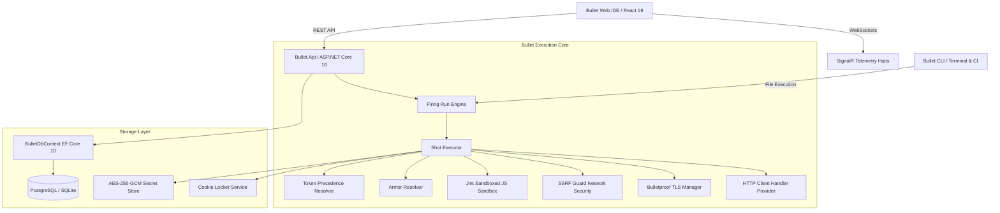

# BULLET: Load. Aim. API.

> A serious, production-grade API development and automated testing platform for engineering teams. Built on **.NET 10**, **C# 13**, **React 19**, and **Vite**.

---

## What is Bullet?

Bullet is a modern, developer-centric, high-performance alternative to traditional API clients such as Postman and Insomnia.

Bullet is **not** a UI mockup, **not** a prototype with placeholder buttons, and **not** a CRUD dashboard. It is a fully operational API platform capable of:
- Executing real HTTP/REST requests with sub-millisecond connection timing diagnostics.
- Running sandboxed JavaScript pre-request triggers and test verifiers with strict memory and CPU boundaries.
- Protecting systems against SSRF by blocking private ranges, loopback addresses, and cloud metadata APIs.
- Managing mutual TLS (mTLS) client certificates, custom enterprise CA bundles, and cipher suites.
- Running automated test suites via an embedded runner (Firing Run) and a native CLI for CI/CD pipelines.
- Serving simulated API responses with configurable latency through an integrated mock engine (Target Range).
- Scheduling autonomous health checks with real-time alerts (Sentinels).

---

## Terminology Matrix

Bullet introduces an intentional, unified domain terminology:

| Bullet Term | Traditional Term | Description |
|---|---|---|
| **Range** | Workspace | Top-level project boundary containing collections and environments. |
| **Arsenal** | Collection | Group of related API requests and test suites. |
| **Squad** | Folder | Sub-folder within an Arsenal for organizational hierarchy. |
| **Shot** | Request | An individual HTTP call definition with headers, parameters, and payload. |
| **Loadout** | Environment | Set of environment variables (e.g., Development, Staging, Production). |
| **Round** | Variable | Key-value token referenced anywhere via `{{variableName}}`. |
| **Trigger** | Pre-request Script | JavaScript executing before a request is fired over the network. |
| **Verifier** | Test Script | JavaScript assertions evaluating the response impact. |
| **Armor** | Authorization | Authentication schemes (Bearer, Basic, API Key, AWS SigV4, OAuth 2.0). |
| **Firing Run** | Collection Runner | Automated test runner with iterations, delay, and data-driven testing. |
| **Target Range** | Mock Server | Local mock server with path matching, simulated latency, and mock responses. |
| **Sentinel** | Monitor | Scheduled autonomous background worker executing API health checks. |
| **Bulletproof TLS** | Certificates | Client mTLS certificates, private keys, and custom enterprise CA roots. |
| **Shot Log** | History | Persistent execution history log with status codes, latency, and payloads. |
| **Cookie Locker** | Cookie Manager | Domain-scoped persistent cookie storage. |
| **Code Shot** | Code Generation | Polyglot code snippet generation in 10 programming languages. |
| **Armory Transfer**| Import / Export | Native `.bullet.json`, Postman v2.1, OpenAPI 3.0, and cURL translation. |
| **Trajectory Console** | Console Dock | Bottom dock streaming real-time execution steps and masked secrets. |
| **Field Manual** | Documentation | In-app technical reference and documentation guide. |

---

## System Architecture



---

## Quickstart Guide

### 1. Prerequisites
- [.NET 10 SDK](https://dotnet.microsoft.com/download/dotnet/10.0) (Version 10.0.103 or higher)
- [Node.js](https://nodejs.org/) (Version 20+ or 22+)

### 2. Run the Backend API
```bash
dotnet run --project src/Bullet.Api
```
The API starts on `http://localhost:5000`. On first startup, the database is automatically created and seeded with a complete demo workspace:
- **Demo Range**: Pre-configured with User APIs, Auth endpoints, Delay simulators, and Health checks.
- **Loadouts**: Development (`{{apiHost}} = http://localhost:5000`) and Production.
- **Automated Verifiers**: Pre-written test scripts asserting status codes, JSON fields, and latency.

### 3. Run the Frontend Web IDE
```bash
cd src/Bullet.Web
npm install
npm run dev
```
Open [http://localhost:3000](http://localhost:3000) in your browser.

### 4. Run the Test Suite
All 18 unit, security, execution, and integration tests pass with 100% success:
```bash
dotnet test Bullet.slnx
```

### 5. Run from CLI / CI Pipelines
```bash
# Execute local test arsenal
dotnet run --project src/Bullet.Cli -- arsenal run demo.bullet.json --report junit --output results.xml
```

### 6. Run with Docker Compose
```bash
docker-compose -f docker/docker-compose.yml up --build
```
Spins up PostgreSQL, Bullet API, and Bullet Web frontend in isolated containers.

---

## Key Features

- **Sandboxed JavaScript**: Jint 4.16.2 runtime with 3-second timeout protection and 10MB memory limits. Infinite loops (`while(true)`) abort automatically.
- **SSRF Guard**: Blocks access to loopback (`127.0.0.1`), private networks (`10.x`, `192.168.x`, `172.16.x`), and cloud metadata APIs (`169.254.169.254`) by default.
- **Secret Encryption**: All tokens marked as secret are encrypted with AES-256-GCM using individual 96-bit nonces.
- **Automated Secret Masking**: Tokens, passwords, and private keys are masked in UI and logs.
- **Polyglot Code Generation**: Generate code snippets in cURL, C# HttpClient, TypeScript fetch, JavaScript axios, Python requests, Go net/http, Rust reqwest, Java 11, PHP cURL, and Ruby Net::HTTP.
- **Armory Transfer**: Import and export collections via native `.bullet.json`, Postman v2.1, OpenAPI 3.0, and cURL.
- **JUnit XML CI/CD Reports**: Export test results formatted for native GitHub Actions, GitLab CI, and Jenkins integration.

---

## License
MIT License. Built with precision for developers.
