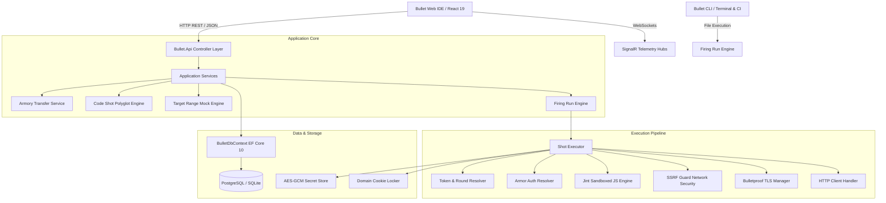
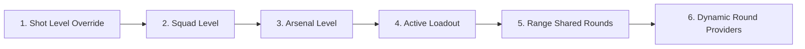

# Bullet System Architecture

> **Tagline**: Load. Aim. API.  
> **Platform**: Production-grade Developer API Platform built on .NET 10, C# 13, React 19, and Vite.

---

## 1. High-Level Architectural Diagram

---

## 2. Solution Structure & Module Responsibilities

| Module | Target Framework | Purpose |
|---|---|---|
| **Bullet.Domain** | `net10.0` | Pure domain entities (`Range`, `Arsenal`, `Squad`, `Shot`, `Loadout`, `Round`, `TLSProfile`, `TargetRange`, `Sentinel`, `FiringRun`), enums, and value objects (`ArmorConfig`, `PayloadConfig`, `ExecutionTelemetry`). Zero external dependencies. |
| **Bullet.Scripting** | `net10.0` | Jint 4.16.2 sandboxed scripting engine. Implements memory limits (10MB), execution timeouts (3s), and exports the `bullet.*` SDK (`request`, `response`, `rounds`, `cookies`, `crypto`, `console`, `test`, `expect`). |
| **Bullet.Security** | `net10.0` | Defense-in-depth security infrastructure: `AesSecretStore` (AES-256-GCM), `SecretMasker` (regex pattern masking for Bearer, Basic, API keys, private keys), `SsrfGuard` (IP validation, loopback/private range blocking, cloud metadata blocking), PBKDF2 hashing, and JWT tokens. |
| **Bullet.Execution** | `net10.0` | The core execution pipeline: `ShotExecutor`, `TokenResolver` (precedence engine), `DynamicRoundsProvider` (`{{$uuid}}`, `{{$timestamp}}`, etc.), `ArmorResolver`, and `TlsManager` (mTLS certificates, custom CA bundles, and TLS version enforcement). |
| **Bullet.Infrastructure** | `net10.0` | EF Core 10 data context supporting PostgreSQL with transparent SQLite fallback, JSON value conversions, entity configurations, and `CookieLockerService`. |
| **Bullet.Application** | `net10.0` | Business services: `FiringRunEngine` (sequential and data-driven runner), `ArmoryTransferService` (Native, Postman v2.1, OpenAPI 3.0, cURL, JUnit XML), `CodeShotService` (10 programming languages), and `TargetRangeEngine` (mock server). |
| **Bullet.Workers** | `net10.0` | `SentinelWorker` background service implementing automated cron-based API health monitoring. |
| **Bullet.Api** | `net10.0` | ASP.NET Core REST API controllers, SignalR telemetry hubs (`ExecutionHub`, `FiringRunHub`), `TestApiController` (in-memory deterministic test bed), and database seeder. |
| **Bullet.Cli** | `net10.0` | Developer terminal and CI tool with command parsing, real-time color output, and JUnit XML test report generation. |
| **Bullet.Web** | React 19 + Vite | Developer IDE interface: dark theme, method badges, token preview, request editor, response inspector, timing graphs, verification test checklist, and trajectory console. |

---

## 3. Variable Token Precedence Resolution

When a Shot is fired, any tokens written in the format `{{variableName}}` undergo resolution in strict hierarchical order:

1. **Shot Ad-hoc Rounds**: Extracted or injected in data-driven iterations.
2. **Squad Default Values**: Inherited from the parent Squad.
3. **Arsenal Variables**: Shared across the collection.
4. **Active Loadout Rounds**: Environment-specific variables (e.g. `{{apiHost}} = https://api.prod.com`).
5. **Shared Range Rounds**: Global variables available across all arsenals.
6. **Dynamic System Rounds**:
   - `{{$uuid}}`: Fresh RFC 4122 v4 UUID.
   - `{{$timestamp}}`: Current Unix epoch in seconds.
   - `{{$isoTimestamp}}`: Current ISO 8601 UTC timestamp.
   - `{{$randomEmail}}`: Synthetic email (`user_xyz@bullet.local`).
   - `{{$randomInt}}`: Random integer between 1 and 1000.
   - `{{$randomAlpha}}`: 8-character random alphanumeric string.

---

## 4. Execution Pipeline Lifecycle

For every Shot fired, the pipeline performs:

1. **Trigger Phase**: Evaluates pre-request script in Jint sandbox. Allows dynamic token creation and header additions.
2. **Token Resolution**: Recursively replaces all `{{tokens}}` in URL, Headers, Parameters, and Payload.
3. **Armor Application**: Resolves authorization credentials and injects headers/parameters.
4. **Security Screening**: Passes target IP/hostname through `SsrfGuard`. Blocks private, loopback, or metadata destinations unless explicitly bypassed.
5. **TLS Configuration**: Applies client certificates, custom CA bundles, and cipher suites via `TlsManager`.
6. **Network Dispatch**: Sends HTTP request using optimized `HttpClient` and records sub-millisecond connection timings (DNS, TCP, TLS, TTFB, Content Download).
7. **Cookie Locker Sync**: Extracts any `Set-Cookie` response headers and updates the domain cookie store.
8. **Verifier Phase**: Executes post-response assertion scripts (`bullet.test`, `bullet.expect`).
9. **Telemetry Broadcast**: Masks any sensitive credentials and streams log entries via SignalR `ExecutionHub` to the Trajectory Console.
10. **Persistence**: Saves a permanent execution record into `ShotLog` for audit and replay.
